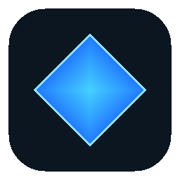

# SC Overlay

<p align="center">
  
</p>

SC Overlay is a desktop companion for Star Citizen. It started as a log watcher, but it has grown into a full in-game overlay for mission tracking, blueprint info, and a few quality-of-life helpers that make the game feel less like a spreadsheet and more like a tool you actually use.

This project is designed to be practical first and transparent second. If a feature needs extra processing, OCR, or a server-side handoff, it is opt-in and clearly separated from the local-first experience.

## What it does

- Mission and blueprint tracking: follow the mission you are currently tracking, see its blueprint pool, and mark what you have already collected.
- Fabricator helper: optional OCR can identify a fabrication kiosk item and help build a capture for the blueprint catalog.
- Mining and refinement helpers: useful context while you play, without making the overlay feel like a second job.
- Optional sync features: if you enable them, the app can send data to my servers for account-based or collection-related features.

## Privacy and opt-in

This matters.

- OCR features are opt-in. They are not enabled by default.
- Any feature that sends data to my servers is opt-in. If you do not enable it, nothing leaves your machine.
- The core experience is local-first. The overlay can work without sending your data anywhere.
- If you do not want a feature, leave it off. That is the intended default.

In plain English: if you want the extra automation, you turn it on. If you do not, the app still works and stays local.

## How it works

The app watches Star Citizen's game log and turns it into structured events. Those events feed the overlay UI, which can surface mission info, blueprint progress, and other helpers while you play.

Optional OCR can be enabled when you want help reading fabrication screens. That is a separate path from the local mission-tracking experience.

## Quick start

Requirements:

- Windows
- Star Citizen installed and running

Install the desktop app:

- Download the latest .exe installer from the releases page.
- Run the installer and follow the setup prompts.

If you are running from source for development purposes, use the project’s local development commands instead.

## Development notes

Useful commands:

```bash
npm run build
npm run typecheck
npm run overlay-app
```

## Project status

This repository is public for transparency and to accept contributions, but it is not open source. The software is licensed under the PolyForm Strict License 1.0.0. You may read the code, ask questions, and contribute improvements, but you may not redistribute it, ship a modified or rebranded build, or use it commercially without a separate written license.

If you want to contribute, the best path is to keep the changes aligned with the project's current direction: useful, local-first, and transparent.
